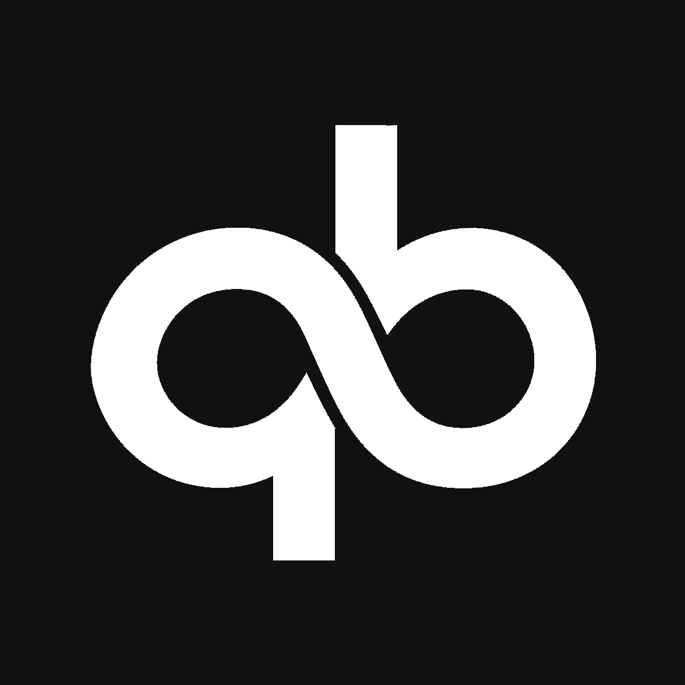
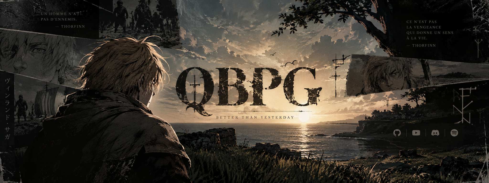

<!-- qbpg-logo:end -->

<!-- qbpg-logo:start --> # 𝒒𝒃𝒑𝒈

I build web applications and browser extensions, with a focus on simplicity and interface design.

[Projects](#projects) · [Technologies](#technologies) · [Contact](#contact)

<!-- Keep username=qbpg: this is the existing cumulative counter. Do not replace it with a new counter ID. -->

<h2 align="center" id="projects">Projects / Projets</h2>

<a href="https://github.com/qbpg/Folio">Folio</a> — Edit, inspect and capture pages locally. / Modifiez, inspectez et capturez des pages localement.

<h2 align="center" id="technologies">Technologies</h2>

<h3>Languages</h3>

  
  
  
  
  

<h3>Frontend</h3>

  
  
  
  

<h3>Backend & databases</h3>

  
  
  
  
  

<h3>Deployment & tools</h3>

  
  
  
  
  
  
  
  
  
  

<h2 align="center" id="contact">Contact</h2>

  
  &nbsp;
  

 

*« I have no enemies. » — Thorfinn, Vinland Saga*

